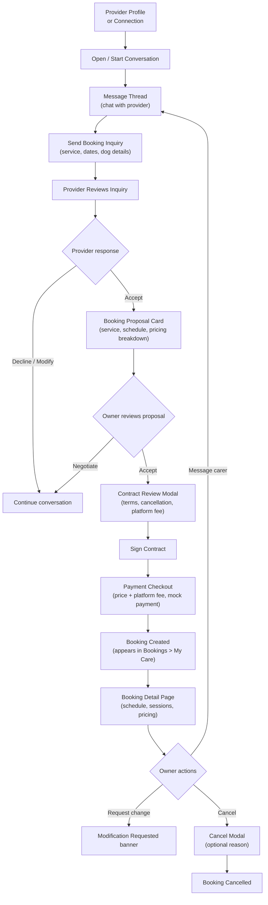

# Booking Conversation Flow

The full booking journey — from first message through to payment and active booking management.

## Step status

| Step | Route / Component | Status |
|------|-------------------|--------|
| Conversation list (inbox) | `/inbox` | Done |
| Message thread | `/inbox/[conversationId]` | Done |
| Inquiry form (multi-step modal) | `InquiryForm` in thread | Done |
| Inquiry chips display | `InquiryChips` | Done |
| Booking proposal card | `BookingProposalCard` | Done |
| Contract signing modal | `SigningModal` in thread | Done |
| Payment mock checkout | `/bookings/[bookingId]/checkout` | Done (Phase 11) |
| Platform fee display | Checkout page + booking detail | Done (Phase 11) |
| Bookings hub (My Care + My Services tabs) | `/bookings` | Done (Phase 18) |
| Booking detail page | `/bookings/[bookingId]` | Done |
| Owner actions (cancel/modify/message) | Booking detail page | Done (Phase 11) |
| Booking cancellation modal | `CancelBookingModal` | Done (Phase 11) |
| Carer inquiry response (accept/decline) | Inbox thread | Done (Phase 12) |

## Notes

- Payment checkout is a mock — Visa ending in 4242, no real payment processing
- Platform fee is 12%, shown transparently on the checkout page
- Cancellation reason is optional but stored on the booking
- Modification is a mock state — shows a "Modification requested" banner, no real negotiation flow
- Bookings page (`/bookings`) has two tabs: My Care (owner bookings) and My Services (provider dashboard). Phase 18 elevated Bookings to a top-level nav tab.
- Old route `/activity?tab=bookings` redirects to `/bookings`. Old `/activity?tab=services` redirects to `/bookings?tab=services`.
