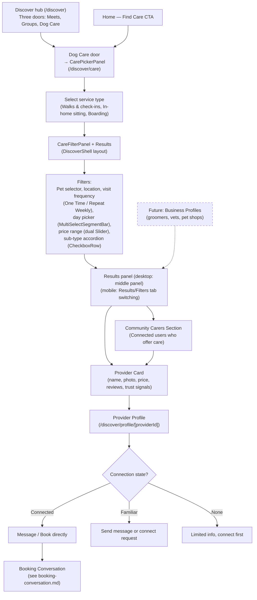

# Care Discovery Flow

Finding a care provider — accessed via the Discover hub > Dog Care card or "Find Care" CTAs. Community trust signals surface throughout.

## Step status

| Step | Route | Status |
|------|-------|--------|
| Discover hub with three doors (Meets, Groups, Dog Care) | `/discover` | Done |
| CarePickerPanel — service type selector (Walks & check-ins, In-home sitting, Boarding) | `/discover/care` | Done |
| CareFilterPanel — interactive filters (pet selector, location, frequency, day picker, price range, sub-type accordion) | `/discover/care` | Done |
| Filter panel (mobile) — Results/Filters tab switching via DiscoverShell | `/discover/care` | Done |
| Results panel (desktop: middle panel in DiscoverShell) | `/discover/care` | Done |
| Provider result cards | `/discover/care` | Done |
| Community carer section | `/discover/care` | Done |
| Provider profile page | `/discover/profile/[providerId]` | Done |
| Connection-gated actions | `/discover/profile/[providerId]` | Done (Phase 11) — TrustGateBanner + disabled CTAs for non-connected |
| Payment mock checkout | `/bookings/[bookingId]/checkout` | Done (Phase 11) |
| Business profiles | — | Not built (deferred) |

## Redirects

| Old route | New destination | Status |
|-----------|----------------|--------|
| `/explore/results` | `/discover/care` | Done |
| `/explore/profile/[id]` | `/discover/profile/[id]` | Done |
| `/discover?tab=care` | `/discover/care` | Done (Phase 19) |

## Notes

- Care discovery starts at the **Discover hub** (`/discover`), which presents three doors: Meets, Groups, Dog Care. Selecting Dog Care loads `/discover/care`.
- `/discover/care` opens the **CarePickerPanel** — a service type selector offering Walks & check-ins, In-home sitting, and Boarding. Selecting a type loads the **CareFilterPanel** with interactive filters: service display, pet selector, location, visit frequency toggle (One Time / Repeat Weekly), day picker (MultiSelectSegmentBar), price range (dual Slider), and service sub-type accordion (CheckboxRow).
- Results appear in the middle panel on desktop or via Results/Filters tab switching on mobile, all powered by the **DiscoverShell** layout component.
- Previously at `/explore/results` — moved to `/discover?tab=care` in Phase 18, then to `/discover/care` sub-page in Phase 19.
- Provider profiles moved from `/explore/profile/[id]` to `/discover/profile/[id]`.
- The deck emphasises that care discovery should show **real trust signals from the community** — even for users who skip the social side entirely.
- **Business profiles** (groomers, vets, pet shops) are a separate discovery path proposed in the deck and reassessment (Phase 10). They'd appear alongside individual providers.
