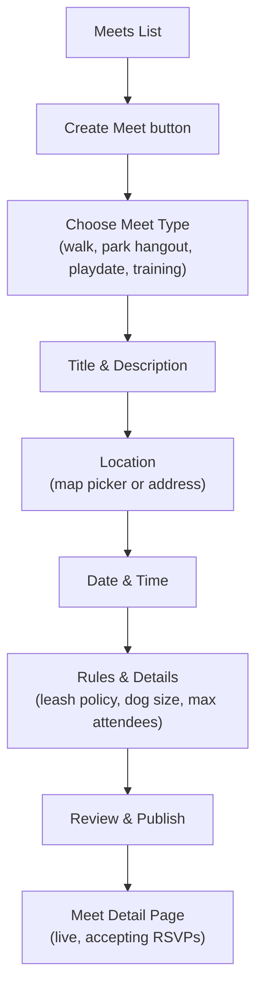

# Meet Creation Flow

Creating a new meet — walks, park hangouts, playdates, or training sessions.

## Step status

| Step | Route | Status |
|------|-------|--------|
| Create meet button | `/meets` | Done |
| Multi-step form | `/meets/create` | Done |
| Meet type selection | `/meets/create` | Done |
| Title & description | `/meets/create` | Done |
| Location picker | `/meets/create` | Done |
| Date & time | `/meets/create` | Done |
| Rules & details | `/meets/create` | Done |
| Published meet | `/meets/[id]` | Done |
