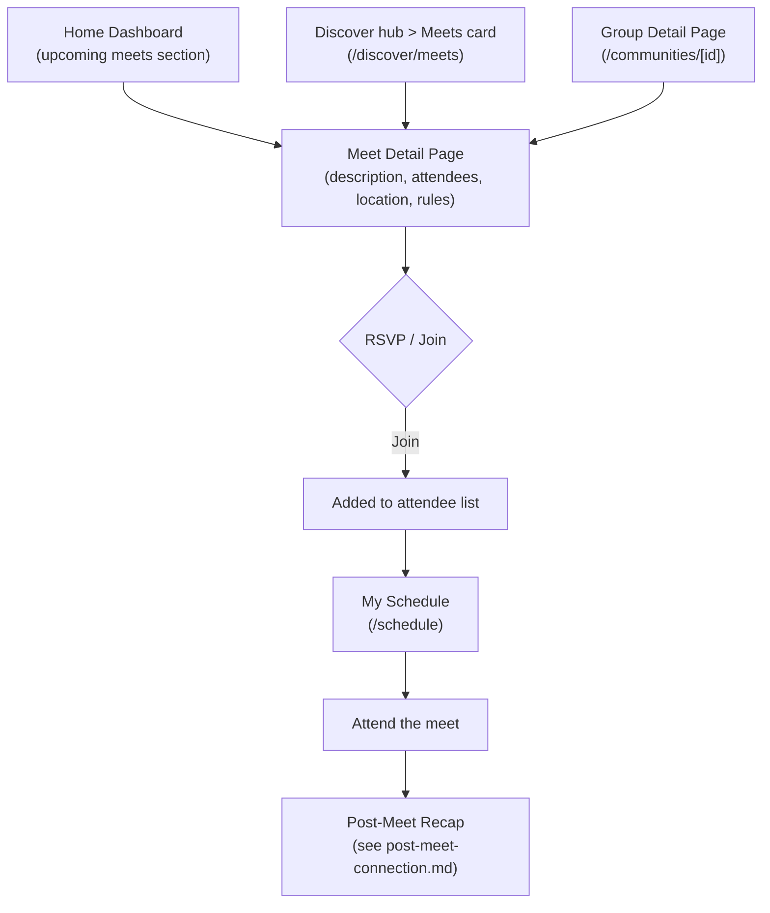

# Meet Discovery & Attendance Flow

Finding, browsing, and attending meets — the primary community engagement loop.

## Step status

| Step | Route | Status |
|------|-------|--------|
| Home — upcoming meets strip | `/home` | Done |
| Discover hub with three doors (Meets, Groups, Dog Care) | `/discover` | Done |
| Meets sub-page — meet browse + filters | `/discover/meets` | Done |
| My Schedule — standalone page with Upcoming/History | `/schedule` | Done |
| Meet detail page | `/meets/[id]` | Done |
| RSVP / join action | `/meets/[id]` | Done (mock) |
| Post-meet connection | `/meets/[id]/connect` | Done |
| Groups browse (tab within Home) | `/home?tab=groups` | Done |
| Group detail — upcoming meets | `/communities/[id]` | Done |

## Redirects

| Old route | New destination | Status |
|-----------|----------------|--------|
| `/activity` | `/discover` | Done |
| `/activity?tab=discover` | `/discover/meets` | Done |
| `/activity?tab=schedule` | `/schedule` | Done |
| `/meets` | `/discover/meets` | Done |

## Notes

- Nav: Home | Discover | My Schedule | Bookings | Profile (5 bottom tabs, Phase 19).
- Mobile header shows Logo + Create (+) + Notifications bell + Inbox chat icon on hub pages. Detail pages use DetailHeader with back button.
- Meets are discoverable through three paths: Discover hub > Meets card (global browse), Home > Groups tab → group detail (upcoming meets within a group), and Discover hub > Groups card → group detail.
- Groups browse is a tab within Home (`/home?tab=groups`) and also accessible via Discover hub > Groups card.
