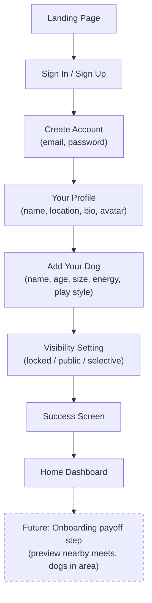

# Onboarding Flow

New user signup — from landing page through to the home dashboard. Provider setup is not part of signup — it happens later through profile edit mode (see [[provider-setup]]).

## Step status

| Step | Route | Status |
|------|-------|--------|
| Landing page | `/` | Done |
| Sign in | `/signin` | Done |
| Create account | `/signup/start` | Done |
| Your profile | `/signup/profile` | Done |
| Add your dog | `/signup/pet` | Done |
| Visibility setting | `/signup/visibility` | Done |
| Success screen | `/signup/success` | Done |
| Home dashboard | `/home` | Done |

## Notes

- Provider role selection, care preferences, pricing, and hosting/walking pages still exist in the codebase (`/signup/role`, `/signup/care-preferences`, etc.) but are **not linked** in the current signup flow. They were removed in Phase 6.
- Provider setup now happens through profile edit mode — see [[provider-setup]].
- Phase 8 proposes an **onboarding payoff step** after success — a preview of nearby activity to give immediate value before the user has done anything.
