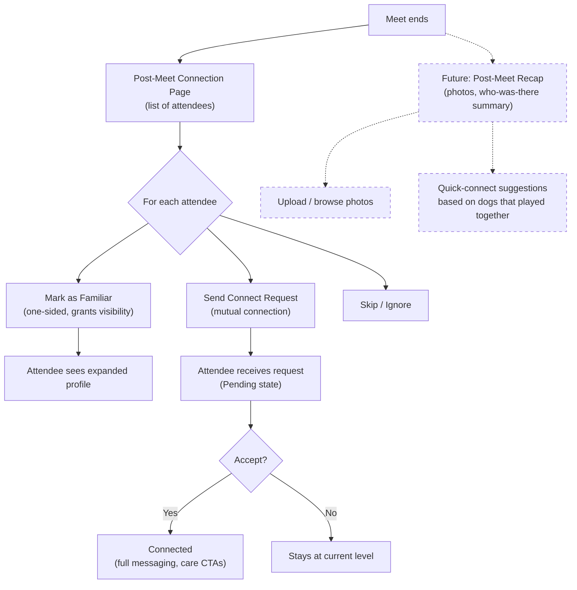

# Post-Meet Connection Flow

After attending a meet, users can mark attendees as Familiar or send Connect requests. This is the primary trust-building mechanism — the conversion moment from "attended" to "connected."

## Step status

| Step | Route | Status |
|------|-------|--------|
| Post-meet connection page | `/meets/[id]/connect` | Done |
| Attendee list with actions | `/meets/[id]/connect` | Done |
| Mark as Familiar | `/meets/[id]/connect` | Done (mock) |
| Send Connect request | `/meets/[id]/connect` | Done (mock) |
| Bulk "Mark all as Familiar" | `/meets/[id]/connect` | Done (Phase 8) |
| Post-meet recap (photos, summary) | `/meets/[id]/connect` | Done (Phase 8) |

## Notes

- **Pending** is a real connection state in the code — it exists between sending a Connect request and the other user accepting. It's an internal implementation detail, not surfaced in external comms (decks, landing page).
- Phase 8 proposes expanding this into a **post-meet recap** — photos, who-was-there, quick-connect suggestions. This is the highest-leverage moment for building lasting connections.
- The deck's **Selective Controls** concept (mark the whole guest list as Familiar, or pick individuals) maps to this screen.
