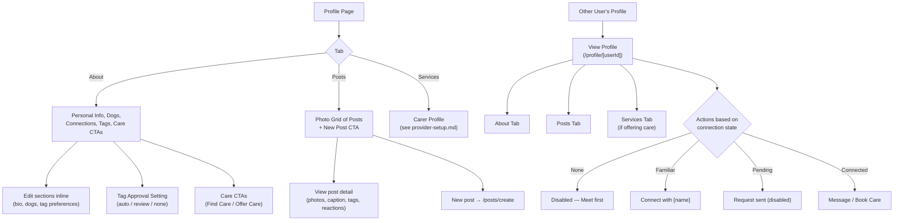

# Profile Management Flow

Managing your profile — personal info, dog profiles, posts, tagging preferences, visibility controls, connections, and carer settings.

## Step status

| Step | Route | Status |
|------|-------|--------|
| Own profile (view) | `/profile` | Done |
| Own profile (edit mode) | `/profile` | Done |
| Dog profile CRUD | `/profile` | Done |
| Posts tab | `/profile?tab=posts` | Done (Phase 10) |
| Tag approval setting | `/profile?tab=about` | Done (Phase 10) |
| Care CTAs on About tab | `/profile?tab=about` | Done (Phase 10) |
| Connection management | `/profile` | Partial — list shown, actions mocked |
| Other user's profile | `/profile/[userId]` | Done |
| About / Posts / Services tabs | `/profile/[userId]` | Done (Phase 10 — replaces About/Services/Reviews) |
| Connection state gating | `/profile/[userId]` | Done (Phase 11) — None=disabled, Familiar=connect, Connected=full |

## Notes

- Phase 10 changed tabs from About / Services / Reviews to About / Posts / Services. Reviews content moved into the Services tab.
- Tag approval is per-user (dog tagging inherits owner setting).
- All "Offer Care" CTAs route to `/profile?tab=services` (Phase 11 consolidation).
- Connection state now gates actions, not just appearance — non-connected users see disabled CTAs with explanatory text.
