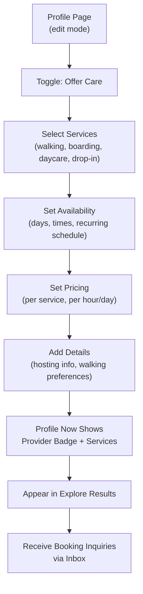

# Provider Setup Flow

Turning on the "provider dial" — going from owner-only to offering care. This happens through profile edit mode, not a separate onboarding.

## Step status

| Step | Route / Component | Status |
|------|-------------------|--------|
| Profile edit mode | `/profile` | Done |
| Offer Care toggle | `/profile` | Partial — toggle exists, services section built |
| Service selection | `/profile` | Done (in carer profile section) |
| Availability setup | `/profile` | Partial |
| Pricing setup | `/profile` | Done (pricing section exists) |
| Provider badge on profile | `/profile/[userId]` | Done |
| Appear in Discover > Care tab | `/discover?tab=care` | Done (mock data) |
| Receive inquiries | `/inbox` | Done (mock conversations) |

## Notes

- **Phase 11 consolidation:** All "Offer Care" entry points (Schedule, AppNav, Home feed, signup success) now route to `/profile?tab=services`. This is the single canonical entry point for provider setup.
- Signup care-specific steps (`/signup/care-preferences`, `/signup/pricing`, etc.) still exist but are not part of the main signup flow (role step was removed in Phase 6). Full provider setup happens in the Profile Services tab.
- Profile edit mode is the ongoing way to adjust the provider dial up or down.
