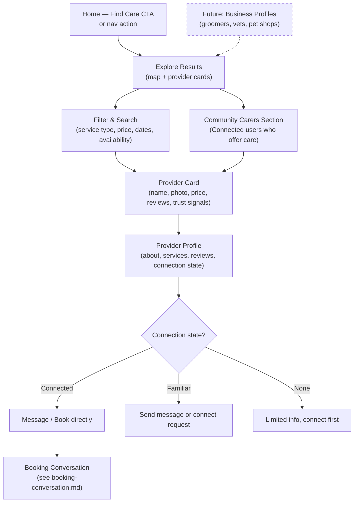

# Care Discovery Flow

Finding a care provider — accessed via "Find Care" CTA, not a default tab. Community trust signals surface throughout. Available any time — no social participation required.

## Step status

| Step | Route | Status |
|------|-------|--------|
| Find Care CTA on Home | `/home` | Done |
| Explore results (map + cards) | `/explore/results` | Done |
| Filter panel (desktop) | `/explore/results` | Done |
| Filter panel (mobile) | `/explore/results` | Done |
| Provider result cards | `/explore/results` | Done |
| Community carer section | `/explore/results` | Done |
| Provider profile page | `/explore/profile/[providerId]` | Done |
| Connection-gated actions | `/explore/profile/[providerId]` | Done (Phase 11) — TrustGateBanner + disabled CTAs for non-connected |
| Payment mock checkout | `/bookings/[bookingId]/checkout` | Done (Phase 11) |
| Business profiles | — | Not built (deferred) |

## Notes

- The deck emphasises that care discovery should show **real trust signals from the community** — even for users who skip the social side entirely.
- **Business profiles** (groomers, vets, pet shops) are a separate discovery path proposed in the deck and reassessment (Phase 10). They'd appear alongside individual providers.
