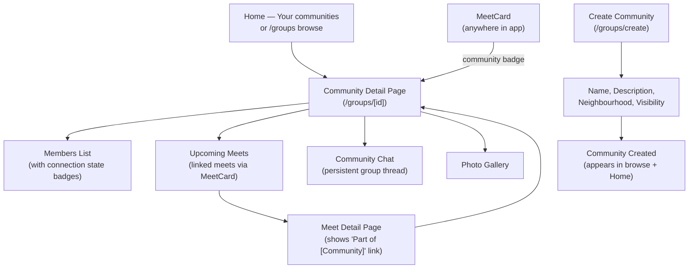

# Groups (Communities) Flow

Persistent communities that turn meets from one-off events into ongoing belonging. Public or private, with chat, gallery, and linked meets.

## Step status

| Step | Route / Component | Status |
|------|-------------------|--------|
| Communities browse page | `/groups` | Done |
| Filter pills (All / Yours / Public / Private) | `/groups` | Done |
| Community detail page | `/groups/[id]` | Done |
| Members list with connection badges | `/groups/[id]` | Done |
| Upcoming meets section | `/groups/[id]` | Done |
| Community chat (toggle) | `/groups/[id]` | Done |
| Photo gallery | `/groups/[id]` | Done |
| Create community form | `/groups/create` | Done |
| "Your communities" on Home | `/home` | Done |
| Community badge on MeetCard | MeetCard component | Done |
| "Part of [Community]" on meet detail | `/meets/[id]` | Done |
| Join/Leave community | `/groups/[id]` | Done (mock) |
| Invite members | `/groups/[id]` | Done (non-functional button) |

## Notes

- User-facing text says "Communities" — code internals use `group` for brevity
- Groups are not a nav tab — accessed from Home section + direct links
- Meets link to groups via `groupId` field (optional). Standalone meets still work without a group.
- Group chat uses the shared `MessageBubble` component (extracted from meet detail in this phase)
