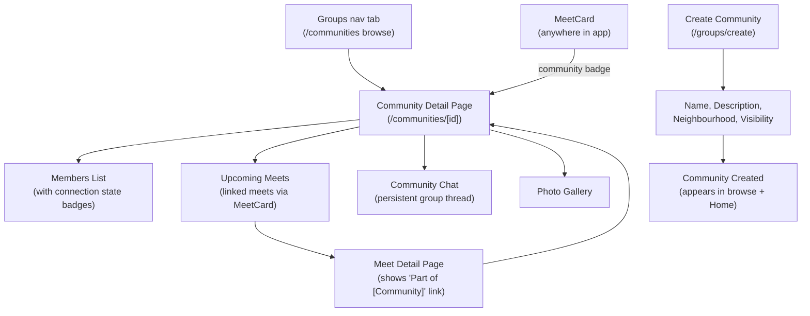

# Groups (Communities) Flow

Persistent communities that turn meets from one-off events into ongoing belonging. Public or private, with chat, gallery, and linked meets.

## Step status

| Step | Route / Component | Status |
|------|-------------------|--------|
| Communities browse page | `/communities` | Done |
| Filter pills (All / Yours / Public / Private) | `/communities` | Done |
| Community detail page | `/communities/[id]` | Done |
| Members list with connection badges | `/communities/[id]` | Done |
| Upcoming meets section | `/communities/[id]` | Done |
| Community chat (toggle) | `/communities/[id]` | Done |
| Join-gated chat (EmptyState + Join CTA for non-members) | `/communities/[id]` | Done |
| System messages (member_joined, meet_posted, rsvp_milestone) | `/communities/[id]` chat | Done |
| Event card strip (horizontal scroll of upcoming meets) | `/communities/[id]` chat | Done |
| Photo gallery | `/communities/[id]` | Done |
| Create community form | `/communities/create` | Done |
| "Your communities" on Home | `/home` | Done |
| Community badge on MeetCard | MeetCard component | Done |
| "Part of [Community]" on meet detail | `/meets/[id]` | Done |
| Join/Leave community | `/communities/[id]` | Done (mock) |
| Invite members | `/communities/[id]` | Done (non-functional button) |

## Notes

- User-facing label is "Groups" (renamed from "Communities" in Phase 16) — code internals use `group` for brevity, routes remain `/communities`
- Groups is a main nav tab: Home | Groups | Activities | Inbox | Profile
- Route is `/communities` (moved from `/groups` in Phase 14)
- Meets link to groups via `groupId` field (optional). Standalone meets still work without a group.
- Group chat uses the shared `MessageBubble` component (extracted from meet detail in Phase 9)
- Group chat is join-gated: non-members see EmptyState with Join CTA (Phase 14)
- System messages (member_joined, meet_posted, rsvp_milestone) rendered via SystemMessage component (Phase 14)
- Event card strip at top of chat shows upcoming meets via MeetCardCompact (Phase 14)
