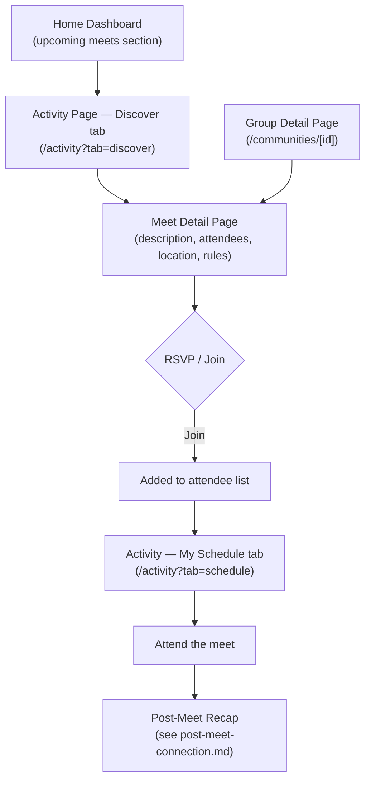

# Meet Discovery & Attendance Flow

Finding, browsing, and attending meets — the primary community engagement loop.

## Step status

| Step | Route | Status |
|------|-------|--------|
| Home — upcoming meets | `/home` | Done |
| Activity page with tabs (Discover / My Schedule / Bookings) | `/activity` | Done |
| Discover tab — meet browse + filters | `/activity?tab=discover` | Done |
| My Schedule tab — upcoming + past | `/activity?tab=schedule` | Done |
| Bookings tab — care arrangements | `/activity?tab=bookings` | Done |
| `/meets` redirect to Activity > Discover | `/meets` → `/activity?tab=discover` | Done |
| `/schedule` redirect to Activity | `/schedule` → `/activity` | Done |
| Meet detail page | `/meets/[id]` | Done |
| RSVP / join action | `/meets/[id]` | Done (mock) |
| Post-meet connection | `/meets/[id]/connect` | Done |

## Notes

- The Activity page consolidates the old `/meets` (browse) and `/schedule` (personal) pages into a single tabbed view with three sub-tabs: Discover, My Schedule, Bookings.
- Nav: Home | Groups | Activities | Inbox | Profile (Phase 16 rename from Communities/Activity).
- Meets are discoverable through two paths: Activities > Discover (global browse) and Groups > group detail (upcoming meets within a group).
