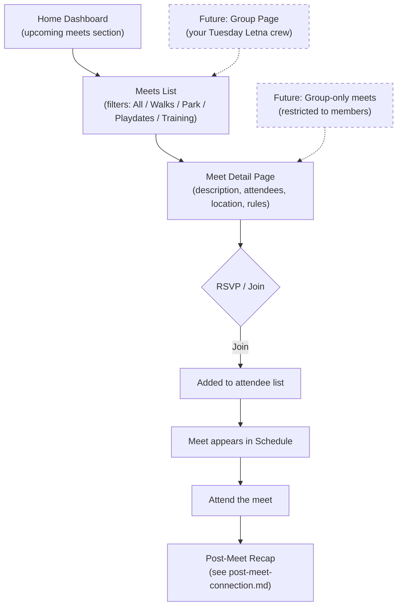

# Meet Discovery & Attendance Flow

Finding, browsing, and attending meets — the primary community engagement loop.

## Step status

| Step | Route | Status |
|------|-------|--------|
| Home — upcoming meets | `/home` | Done |
| Meets list + filters | `/meets` | Done |
| Meet detail page | `/meets/[id]` | Done |
| RSVP / join action | `/meets/[id]` | Done (mock) |
| Schedule view | `/schedule` | Done |
| Post-meet connection | `/meets/[id]/connect` | Done |

## Future (Phase 9)

In the proposed Groups model, meets become **events within groups** — you can browse open meets or see meets from groups you belong to. Group-only meets would be restricted to members. This changes the entry points but not the core attend → connect loop.
